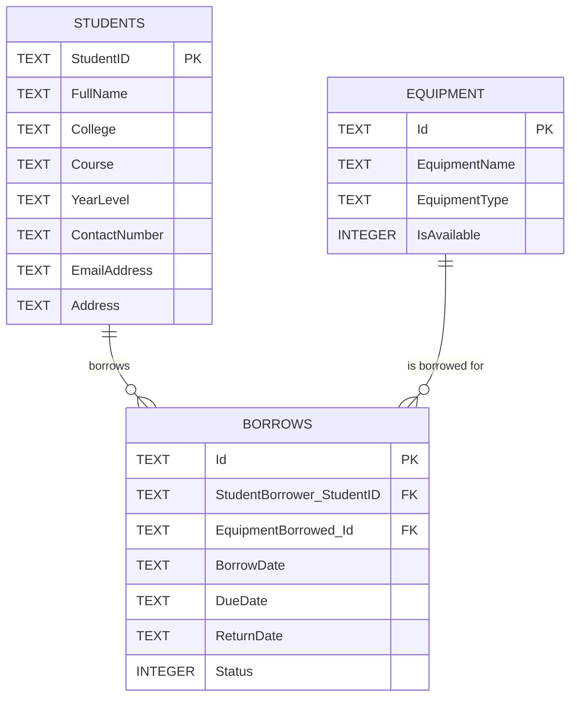

# Student Equipment Borrowing System

A layered (Clean/Onion-style) application demonstrating a student borrowing
equipment from a school inventory. Validation and business rules are handled by
the Application layer (application services); the UI and Infrastructure provide
composition and persistence only.

This repository contains:
- Domain: core entities and invariants
- Application: use-case services and repository interfaces
- Infrastructure: concrete repository implementations (in-memory by default)
- An Avalonia Desktop UI located at `src/StudentEquipBorrowSystem.Desktop`
- A test/executable project at `tests/TestProgram`

## 1. Solution Structure

- **Domain**
  The core of the system: entities (`Student`, `Equipment`, `Borrow`, `Staff`) and
  the `BorrowStatusEnum`. These classes own their own invariants — for example,
  `Student.CanBorrowEquipment()` and `Equipment.MarkAsBorrowed()`/`MarkAsReturned()`
  are the *only* way to change state, since every property setter is private. Domain
  has **no dependencies** on any other project; it doesn't know that a database, a
  console, or a UI even exists.

- **Application**
  The use-case layer. It contains:
  - Repository **interfaces** (`IStudentRepository`, `IEquipmentRepository`, `IBorrowRepository`) — contracts for fetching/storing domain objects, with no knowledge of *how* that storage happens.
  - **Services** (`BorrowService`, implementing `IBorrowService`) — orchestrate a use case by pulling in domain objects and repository interfaces, applying business rules (borrow limits, availability checks), and returning a result.

  Application depends only on **Domain**. It never references Infrastructure.

- **Infrastructure**
  Concrete, technology-specific implementations of the Application-layer
  interfaces — currently `StudentInMemoryRepository`, `EquipmentInMemoryRepository`,
  and `BorrowInMemoryRepository`, each backed by a simple in-memory `List<T>`. This
  is the layer that would later be swapped out or extended (e.g. for SQLite,
  a JSON file, or a REST API) without touching Domain or Application at all.

- **Tests**
  Not yet present as a separate project in this demo, but this is where automated
  tests would live — unit tests for `BorrowService`'s business rules (using the
  in-memory repositories or hand-written fakes as fast, dependency-free test
  doubles), and, if `Tests` referenced Infrastructure, integration tests against a
  real database. It would depend on Domain and Application (and optionally
  Infrastructure), the same way `Program.cs` does now.

## 2. Dependency Direction

```text
Executable / Future UI (Program.cs today, an Avalonia project later)
          │
          ▼
     Application
       │      ▲
       ▼      │
     Domain   │
              │
     Infrastructure
```

- The **Executable/UI** depends on **Application** (to call use cases) and on
  **Infrastructure** (only at startup, to wire up which concrete repository
  implementation to use — this is the composition root).
- **Application** depends on **Domain** only. It defines repository interfaces but
  never implements or references them.
- **Infrastructure** depends on both **Domain** (to work with entities) and
  **Application** (to implement its repository interfaces).
- **Domain** depends on nothing. It sits at the center and is the most stable,
  least-changing part of the solution.

The arrow that matters most: Application never points at Infrastructure. Infrastructure
points at Application (via implementing its interfaces), not the other way around —
this inversion is what lets the storage technology change freely.

## 3. Use Case Mapping

```text
Actor:                         Student
Use Case:                      Borrow Equipment
Application Service:           BorrowService.BorrowEquipment(student, equipment, dueDate)
Domain Objects Used:           Student, Equipment, Borrow, BorrowStatusEnum
Repository Interfaces Used:    IBorrowRepository (to persist the new Borrow record);
                                IStudentRepository, IEquipmentRepository
                                (used by the caller to look up the Student and
                                Equipment before invoking the service)
Infrastructure Implementations
Used:                           BorrowInMemoryRepository, StudentInMemoryRepository,
                                EquipmentInMemoryRepository
```

## 4. Reflection

**1. Why should the application service depend on a repository interface instead of directly depending on a database implementation?**
It keeps the business rules (borrow limits, availability checks) completely
independent of *how* data is stored. `BorrowService` can be unit tested with a fast
in-memory fake, and the real storage technology (SQLite, a file, an API) can be
chosen or changed later without touching a single line of business logic. It also
prevents Application from needing a reference to whatever database library
Infrastructure uses.

**2. Which parts of your current solution could remain unchanged if SQLite were added later?**
All of **Domain** and all of **Application** (interfaces and services) — they don't
know or care that storage changed. Only **Infrastructure** would change: new classes
like `StudentSqliteRepository` would be written to implement the existing
`IStudentRepository` interface. `Program.cs` would need a one-line change to
register the new implementation instead of the in-memory one.

**3. Which project would eventually contain Avalonia Views?**
A new UI/Presentation project (e.g. `StudentBorrowEquipSystem.UI`) that depends on
**Application** (to call services like `BorrowService`) and on **Infrastructure**
(only at startup, to wire dependencies). Views and ViewModels belong there —
never inside Domain, Application, or Infrastructure.

**4. Should an Avalonia button directly execute database queries? Why or why not?**
No. That would collapse the layers — the UI would end up owning business rules and
data-access code, making them impossible to test independently and impossible to
reuse if a second UI (e.g. a web API) were added later. The button's click handler
should call an Application service method (e.g. `BorrowEquipment(...)`), exactly
like `Program.cs` does now; the service still owns the validation, and a repository
implementation still owns the actual query.

**5. What part of your implementation represents the actual business operation requested by the actor?**
`BorrowService.BorrowEquipment(...)`. It's the single place where the real
business operation — "a student borrows a piece of equipment" — is defined:
checking eligibility, checking availability, creating the `Borrow` record, and
updating related domain state. Everything else (`Program.cs`, the repositories)
is supporting plumbing that feeds this operation or persists its result.

---

# Persistence with SQLite and EF Core

The sections below extend the application with a relational database. Sections 1-4 above
(the in-memory, layered version) are unchanged and still describe the architecture; the
in-memory repositories are kept and are still used by the console demo in `tests/TestProgram`.

## 5. Relational Database Design

### 5.1 Database diagram


The same design as text (physical table and column names as created by the migration):



> The diagram image uses the conceptual names `BORROWINGS`, `StudentId` and `EquipmentId`.
> In the database the table is `Borrows` and the foreign key columns are
> `StudentBorrower_StudentID` and `EquipmentBorrowed_Id` (EF Core names them after the
> navigation properties `Borrow.StudentBorrower` and `Borrow.EquipmentBorrowed`).

### 5.2 Tables

**Students** - one row per registered student (entity `Student`).

| Column | Type | Null? | Notes |
|---|---|---|---|
| `StudentID` | TEXT (max 20) | No | Primary key |
| `FullName` | TEXT (max 200) | No | |
| `College` | TEXT (max 200) | No | |
| `Course` | TEXT (max 200) | No | |
| `YearLevel` | TEXT (max 50) | No | |
| `ContactNumber` | TEXT (max 20) | No | |
| `EmailAddress` | TEXT (max 100) | Yes | Optional |
| `Address` | TEXT (max 500) | Yes | Optional |

**Equipment** - one row per borrowable item (entity `Equipment`).

| Column | Type | Null? | Notes |
|---|---|---|---|
| `Id` | TEXT (GUID) | No | Primary key |
| `EquipmentName` | TEXT (max 200) | No | |
| `EquipmentType` | TEXT (max 100) | No | |
| `IsAvailable` | INTEGER (0/1) | No | Default `1` (available) |

**Borrows** - one row per borrowing transaction (entity `Borrow`).

| Column | Type | Null? | Notes |
|---|---|---|---|
| `Id` | TEXT (GUID) | No | Primary key |
| `StudentBorrower_StudentID` | TEXT | Yes* | Foreign key to `Students.StudentID` |
| `EquipmentBorrowed_Id` | TEXT (GUID) | No | Foreign key to `Equipment.Id` |
| `BorrowDate` | TEXT (ISO-8601) | No | |
| `DueDate` | TEXT (ISO-8601) | No | |
| `ReturnDate` | TEXT (ISO-8601) | Yes | `NULL` until the item is returned |
| `Status` | INTEGER | No | Default `0`; see below |

\*The domain model always sets the student, but the relationship was configured as optional,
so the column is nullable in the migration. This is why the active-borrowings query uses a
`LEFT JOIN` for students (see section 10).

SQLite has no native `bool`, `Guid`, `DateTime` or enum types, so EF Core stores them as:
`bool` as `INTEGER` 0/1, `Guid` and `DateTime` as `TEXT`, and `BorrowStatusEnum` as `INTEGER`
(`0` = Active, `1` = Returned, `2` = Overdue).

### 5.3 Keys

| Table | Primary key | Constraint name |
|---|---|---|
| `Students` | `StudentID` | `PK_Students_StudentID` |
| `Equipment` | `Id` | `PK_Equipment_Id` |
| `Borrows` | `Id` | `PK_Borrows_Id` |

| Foreign key | References | Constraint name |
|---|---|---|
| `Borrows.StudentBorrower_StudentID` | `Students.StudentID` | `FK_Borrows_Students_StudentID` |
| `Borrows.EquipmentBorrowed_Id` | `Equipment.Id` | `FK_Borrows_Equipment_Id` |

### 5.4 Relationships

- **Student 1 : many Borrows** - a student can have many borrowings over time; each borrowing belongs to one student.
- **Equipment 1 : many Borrows** - one piece of equipment is borrowed many times over its life (never twice at the same time); each borrowing is for one piece of equipment.
- `Borrows` is therefore the table that links `Students` and `Equipment`.

Both relationships use `ON DELETE RESTRICT`: a student or equipment row cannot be deleted
while borrow records still point to it, so borrowing history is never orphaned.

### 5.5 Important constraints

| Constraint | Where | Purpose |
|---|---|---|
| Primary keys | all three tables | Every row is uniquely identifiable |
| Foreign keys with `RESTRICT` | `Borrows` | A borrowing cannot reference a missing student/equipment, and referenced rows cannot be deleted |
| `NOT NULL` | required columns (names, dates, `Status`, `IsAvailable`, ...) | Required information is always present |
| Unique index `IX_Students_StudentID_Unique` | `Students.StudentID` | No two students share an ID |
| Defaults | `IsAvailable = 1`, `Status = 0` | New equipment is available; new borrows are Active |
| Max lengths | text columns (see tables) | Recorded in the EF Core model; SQLite itself does not enforce `TEXT` lengths, so input validation (e.g. `StudentService`) is still needed |
| Indexes | `IX_Borrows_StudentID`, `IX_Borrows_EquipmentId`, `IX_Borrows_Status`, `IX_Borrows_DueDate`, `IX_Equipment_IsAvailable`, `IX_Equipment_EquipmentType`, `IX_Students_ContactNumber` | Speed up the queries the application runs (filters, joins, sorting) |

**Rules that are not database constraints.** The 3-item borrow limit
(`Student.MaxBorrowLimit`) and the "equipment must be available" rule live in the Domain and
Application layers (`Student.CanBorrowEquipment`, `BorrowService`). They depend on counting
and comparing data, so they are enforced in code, not by the schema.

## 6. SQLite and EF Core

**SQLite** is a file-based relational database: no server to install, and the whole database
is one file (`EquipmentBorrowing.db`). That suits a desktop application. **Entity Framework
Core (EF Core)** is the object-relational mapper that translates between the domain objects
(`Student`, `Equipment`, `Borrow`) and the tables above.

How they were added:

1. **Packages** were added to the **Infrastructure** project (`StudentEquipBorrowSystem.Infrastructure`),
   the only project that knows about the database:

   | Package | Version | Purpose |
   |---|---|---|
   | `Microsoft.EntityFrameworkCore` | 10.0.0 | EF Core itself: `DbContext`, LINQ translation, change tracking |
   | `Microsoft.EntityFrameworkCore.Sqlite` | 10.0.0 | The SQLite provider for EF Core |
   | `Microsoft.EntityFrameworkCore.Design` | 10.0.0 | Design-time components used by the `dotnet ef` migration tooling |
   | `SQLitePCLRaw.lib.e_sqlite3` | 2.1.12-pre20260709125052 (prerelease) | The native SQLite engine that the provider loads; added as an explicit reference |

   ```bash
   dotnet add src/StudentEquipBorrowSystem.Infrastructure package Microsoft.EntityFrameworkCore --version 10.0.0
   dotnet add src/StudentEquipBorrowSystem.Infrastructure package Microsoft.EntityFrameworkCore.Sqlite --version 10.0.0
   dotnet add src/StudentEquipBorrowSystem.Infrastructure package Microsoft.EntityFrameworkCore.Design --version 10.0.0
   ```
   The three EF Core packages use the same version (10.0.0), which matches the
   `ProductVersion` recorded in the generated migration. (The same packages can be installed
   from Visual Studio through *Manage NuGet Packages*.)
2. **A `DbContext`** (`EquipmentBorrowingDbContext`) and **entity configurations**
   (`StudentConfiguration`, `EquipmentConfiguration`, `BorrowConfiguration`) were added under
   `Infrastructure/Persistence` to describe the tables, keys, relationships and indexes.
3. **EF Core repositories** (`EfStudentRepository`, `EfEquipmentRepository`,
   `EfBorrowRepository`) were added under `Infrastructure/Repositories`, implementing the
   existing Application-layer interfaces.
4. **Registration:** `AddSqlitePersistence(connectionString)` in `Infrastructure/DependencyInjection.cs`
   registers the context and the three repositories. The Avalonia composition root (`App.axaml.cs`) calls it once:
   ```csharp
   var dbPath = Path.Combine(AppContext.BaseDirectory, "EquipmentBorrowing.db");
   services.AddSqlitePersistence($"Data Source={dbPath}");
   ```
5. **A design-time factory** (`EquipmentBorrowingDbContextFactory`) lets the EF Core tools create the context without starting the UI.
6. **Startup initialization:** `provider.InitializeDatabase()` applies pending migrations and
   adds any missing demo data (`DemoDataSeeder`). It never recreates or overwrites the database.

Domain and Application have **no reference** to EF Core or SQLite; only Infrastructure does.
The Desktop project references Infrastructure only to call the registration and startup methods.

## 7. DbContext

`EquipmentBorrowingDbContext` (in `Infrastructure/Persistence`) is EF Core's gateway to the
database. Its responsibilities:

- **Describes the model.** It exposes `DbSet<Student>`, `DbSet<Equipment>` and `DbSet<Borrow>`, one per table, and applies the three `IEntityTypeConfiguration` classes in `OnModelCreating`. Those configurations define table names, keys, column types, lengths, defaults, foreign keys and indexes, keeping the Domain classes free of database attributes.
- **Translates LINQ to SQL.** Queries written against the `DbSet`s are turned into SQL and the resulting rows are turned back into domain objects.
- **Tracks changes.** For tracked entities it remembers what changed, and `SaveChangesAsync()` writes those changes as `INSERT` / `UPDATE` / `DELETE` statements in one transaction (a unit of work).
- **Manages the connection and schema.** It owns the SQLite connection and, through `Database.MigrateAsync()`, applies migrations.

What it does **not** do: business rules (borrow limit, availability). Those stay in the
Domain and Application layers. The context is also used **only inside the repositories**;
nothing above Infrastructure touches it. In this application it is registered as a
**singleton** because the app services and ViewModels are singletons, which is why
read-only queries use `AsNoTracking()` (see section 9).

## 8. Repository Transition

**Before (in-memory):**

```text
Repository Interface   (IBorrowRepository, IStudentRepository, IEquipmentRepository)
        ↓
In-Memory Repository   (List<T> in memory; data lost when the app closes)
```

**After (SQLite):**

```text
Repository Interface   (unchanged; defined in Application)
        ↓
EF Core Repository     (EfBorrowRepository, EfStudentRepository, EfEquipmentRepository)
        ↓
SQLite                 (EquipmentBorrowing.db, accessed through EquipmentBorrowingDbContext)
```

What changed and what did not:

| | Before | After |
|---|---|---|
| Storage | `List<T>` per repository | SQLite tables via EF Core |
| Lifetime of data | Until the app exits | Survives restarts |
| Filtering/sorting | LINQ to Objects in memory | Translated to SQL, run by SQLite |
| Saving | Mutate the list | `SaveChangesAsync()` |
| Registration | `new ...InMemoryRepository()` | `services.AddSqlitePersistence(...)` |
| `BorrowService`, `IBorrowAppService`, ViewModels, Views | - | **Same classes**, still depend on the interfaces |

The repository interfaces gained query methods that let the database do the work
(`IEquipmentRepository.GetAvailableAsync`, `IBorrowRepository.GetActiveAsync`,
`IBorrowRepository.CountActiveByStudentAsync`). Both repository families implement them, so
the in-memory repositories still work for the console demo and for tests.

## 9. Migration Process

A **migration** is a versioned, code-generated description of a schema change. The first one,
`InitialCreate` (`20261004121055_InitialCreate`), creates the three tables, keys,
foreign keys and indexes from section 5.

**One-time setup** (installs the EF Core command-line tool):

```bash
dotnet tool install --global dotnet-ef
```

**Create the migration** (run from the solution folder, where `StudentEquipBorrowSystem.slnx` is):

```bash
dotnet ef migrations add InitialCreate --project src/StudentEquipBorrowSystem.Infrastructure --startup-project src/StudentEquipBorrowSystem.Infrastructure
```

EF Core compares the model (entities + configurations) with the last snapshot and generates
`<timestamp>_InitialCreate.cs` (`Up` creates the schema, `Down` removes it), a `.Designer.cs`
file, and `EquipmentBorrowingDbContextModelSnapshot.cs`. The design-time factory
(`EquipmentBorrowingDbContextFactory`) is what lets the tool build the context without the UI.

**Update the database:**

```bash
dotnet ef database update --project src/StudentEquipBorrowSystem.Infrastructure --startup-project src/StudentEquipBorrowSystem.Infrastructure
```

This creates the SQLite file (if needed) and applies every migration not yet recorded in the
`__EFMigrationsHistory` table. Note that the design-time factory uses the relative path
`Data Source=EquipmentBorrowing.db`, so this command creates the file in the current working directory.

**Automatic update at runtime:** the application also does this itself. On startup,
`InitializeDatabase()` calls `Database.MigrateAsync()`, which creates
`EquipmentBorrowing.db` next to the executable on first launch and does nothing on later
launches. Running `dotnet ef database update` manually is therefore optional.

**After a later model change:** run `dotnet ef migrations add <Name>` again; the new migration
contains only the difference. Never edit an applied migration; add a new one.

## 10. Generated SQL

EF Core does not run LINQ; it translates the expression into SQL. The SQL below was captured
with `LogTo(..., RelationalEventId.CommandExecuted)` in `tests/TestProgram/SqlInspection.cs`:

```bash
dotnet run --project tests/TestProgram -- --sql
```

Each query sits behind a repository interface, so the services never see EF Core. The full
walkthrough is in [`docs/linq_to_sql.md`](docs/linq_to_sql.md).

### Query 1 - Available equipment

*Requirement: a student requests an available piece of equipment, so the Borrow form only offers items that can be borrowed now.*

`EfEquipmentRepository.GetAvailableAsync`

```csharp
_context.Equipment
    .AsNoTracking()
    .Where(e => e.IsAvailable)
    .OrderBy(e => e.EquipmentName)
    .ToListAsync(cancellationToken);
```

```sql
SELECT "e"."Id", "e"."EquipmentName", "e"."EquipmentType", "e"."IsAvailable"
FROM "Equipment" AS "e"
WHERE "e"."IsAvailable"
ORDER BY "e"."EquipmentName"
```

`Where` became `WHERE`, `OrderBy` became `ORDER BY`. SQLite stores a `bool` as 0/1, so the column can be used as the condition directly. Filtering happens inside SQLite, so unavailable rows are never transferred to the application.

### Query 2 - Active borrowings with student and equipment

*Requirement: the Active Borrowings page lists items currently on loan, who has them and when they are due.*

`EfBorrowRepository.GetActiveAsync`

```csharp
_context.Borrows
    .AsNoTracking()
    .Include(b => b.StudentBorrower)
    .Include(b => b.EquipmentBorrowed)
    .Where(b => b.Status != BorrowStatusEnum.Returned)
    .OrderBy(b => b.DueDate)
    .ToListAsync(cancellationToken);
```

```sql
SELECT "b"."Id", "b"."BorrowDate", "b"."DueDate", "b"."EquipmentBorrowed_Id", "b"."ReturnDate",
       "b"."Status", "b"."StudentBorrower_StudentID",
       "s"."StudentID", "s"."Address", "s"."College", "s"."ContactNumber", "s"."Course",
       "s"."EmailAddress", "s"."FullName", "s"."YearLevel",
       "e"."Id", "e"."EquipmentName", "e"."EquipmentType", "e"."IsAvailable"
FROM "Borrows" AS "b"
LEFT JOIN "Students" AS "s" ON "b"."StudentBorrower_StudentID" = "s"."StudentID"
INNER JOIN "Equipment" AS "e" ON "b"."EquipmentBorrowed_Id" = "e"."Id"
WHERE "b"."Status" <> 1
ORDER BY "b"."DueDate"
```

Each `Include` became a `JOIN`, so one statement returns borrows, students and equipment together. The student join is a `LEFT JOIN` because the foreign key column is nullable; the equipment join is an `INNER JOIN` because that column is required. `Status` is an `INTEGER` (Active = 0, Returned = 1, Overdue = 2), so `!= Returned` becomes `<> 1`, which keeps Active and Overdue borrows.

### Query 3 - Number of active borrows for a student

*Requirement: a student may only have 3 items on loan at once, so `BorrowService` needs the current count before approving a new borrow.*

`EfBorrowRepository.CountActiveByStudentAsync`

```csharp
_context.Borrows
    .CountAsync(b => b.StudentBorrower.StudentID == studentID
                     && b.Status != BorrowStatusEnum.Returned,
                cancellationToken);
```

```sql
-- parameter: @studentID = '2024303110'
SELECT COUNT(*)
FROM "Borrows" AS "b"
WHERE "b"."StudentBorrower_StudentID" = @studentID AND "b"."Status" <> 1
```

`CountAsync` became a `COUNT(*)` aggregate, so the application never loads the student's whole history. The ID is passed as a query parameter (not pasted into the SQL), which keeps the statement reusable and safe from SQL injection. No join is needed because `StudentBorrower_StudentID` is the foreign key stored in `Borrows`.

### Tracking: which queries use `AsNoTracking()`

EF Core's change tracker remembers every entity a query returns so it can detect changes and
write them on `SaveChangesAsync()`. That costs memory and time, so it is only worth it when the
entity will be modified.

| Operation | Purpose | Tracking | Why |
|---|---|---|---|
| `GetAvailableAsync`, `GetActiveAsync`, all `GetAllAsync`, `GetByStudentAsync`, `GetByEquipmentAsync` | Fill lists on screen, history | `AsNoTracking()` | Nothing is modified or saved; with a singleton `DbContext`, tracked results would also stay in memory and could be returned stale by later queries |
| `GetByIdAsync` (Borrow, Equipment, Student) | Load an entity that `BorrowService` then changes | Tracked | `ReturnEquipmentAsync` calls `MarkAsReturned()` on the `Borrow` and its `Equipment`; EF Core records the changed properties and `SaveChangesAsync()` issues an `UPDATE` for only those columns. In `BorrowEquipmentAsync` the `Student` and `Equipment` must be tracked so the new `Borrow` links to the existing rows instead of inserting them again |

`AsNoTracking()` does not change the generated SQL; it only changes what EF Core remembers afterwards.

## 11. Persistence Demonstration

**Goal:** show that information is stored in the SQLite file, not in memory, so it survives
closing and reopening the application. With the old in-memory repositories every borrowing
disappeared on exit.

**Where the data lives:** `EquipmentBorrowing.db`, next to the executable
(`AppContext.BaseDirectory`, i.e. the Desktop project's `bin/Debug/net.../` folder).

**How the pair verified it:**

1. Launched the application on a fresh database. Startup applied the migration and seeded the demo data (5 students, 8 equipment items; 4 items borrowed, 4 available).
2. Opened **Borrow Equipment**, selected a student with no borrows (Brill Jarn T. Barazan), chose an available item (*Projector*), picked a due date and borrowed it. The success message was shown.
3. Checked the state: the item appeared on **Active Borrowings**, and on **Equipment** it showed as not available.
4. **Closed the application completely.**
5. Launched it again. Startup ran `MigrateAsync()` (nothing to apply) and the seeder (adds only missing records, never overwrites).
6. Confirmed the same information was still there: the Projector borrowing was still listed on **Active Borrowings** with the same due date, the Projector was still unavailable on **Equipment**, and it was no longer offered on the Borrow form.

Because the borrowing was loaded from `EquipmentBorrowing.db` after a full restart, the data is
persisted by SQLite through the EF Core repositories rather than held in memory.

**The same check can be repeated for returns and for the borrow limit:**

- Return the item from **Active Borrowings**, close and relaunch: the borrowing is gone from the active list and the Projector is available again.
- The seeded student Travis S. Vergel de Dios has 3 active borrows, so borrowing a 4th item is refused after every relaunch. This works because `BorrowService` counts the stored borrow records through `CountActiveByStudentAsync` instead of using an in-memory counter.

**Verification directly in the database** (optional): open `EquipmentBorrowing.db` in any
SQLite tool and run the queries in `docs/database-queries.sql`, for example:

```sql
SELECT s.FullName, e.EquipmentName, b.DueDate, b.Status
FROM Borrows AS b
JOIN Students  AS s ON s.StudentID = b.StudentBorrower_StudentID
JOIN Equipment AS e ON e.Id = b.EquipmentBorrowed_Id
WHERE b.Status = 0;
```

The row created in step 2 is present before and after each restart.

## 12. Architectural Reflection

**1. Why did the application not need to be completely rewritten when SQLite was introduced?**
Application and the UI depend on repository **interfaces**, never on a storage technology.
Adding SQLite meant writing new Infrastructure classes that implement those same interfaces,
plus one registration line in the composition root. Domain, `BorrowService`, the app services,
ViewModels and Views were not rewritten.

**2. Why should the ViewModel not use `DbContext` directly?**
It would put data access and business rules in the UI layer: the borrow limit and availability
checks could be bypassed, the ViewModel could not be tested without a database, and it would be
tied to EF Core, so the storage could not be changed without editing the UI. It would also
expose the shared singleton `DbContext` (and its change tracker) to UI code. ViewModels call
`IBorrowAppService` / `ILookupAppService` and work with DTOs.

**3. What responsibility does the repository implementation now perform?**
It turns the Application layer's requests into EF Core/SQL operations and persists the results:
building the LINQ queries (filters, `Include` joins, ordering, counts), choosing tracking or
`AsNoTracking()`, and calling `SaveChangesAsync()`. It hides EF Core and SQLite from everything above it.

**4. What is the purpose of an EF Core migration?**
It is a versioned, repeatable script of a schema change, generated from the model and stored in
source control. It creates or updates the database so that tables, keys and indexes match the
code, can be applied to any machine (here automatically at startup), and is recorded in
`__EFMigrationsHistory` so it is applied only once.

**5. Why are foreign keys important in the borrowing database?**
They guarantee referential integrity: a borrowing cannot point to a student or equipment item
that does not exist, and with `RESTRICT`, a student or item that still has borrow records
cannot be deleted. They also define the relationships that `Include` turns into joins.

**6. Why can a read-only query benefit from `AsNoTracking()`?**
EF Core does not need to build and keep change-tracking snapshots for entities that will never
be saved, which saves memory and processing time. With the singleton `DbContext` used here it
also stops old tracked instances from being reused by later queries. The SQL is identical.

**7. What would happen to the rest of the application if the SQLite implementation were replaced later by another database provider?**
Domain, Application, ViewModels and Views would stay unchanged because they only know the
interfaces. Only Infrastructure changes: for another EF Core provider (e.g. SQL Server or
PostgreSQL), swap `UseSqlite` in `AddSqlitePersistence` and regenerate the migrations. The
entity configurations currently set SQLite storage types explicitly (`HasColumnType("TEXT")` /
`"INTEGER"`), so they would need adjusting, and the raw SQL in `docs/database-queries.sql` (such as
`julianday`) would need rewriting. For a non-EF storage (a REST API, say), new repository
classes would implement the same three interfaces.